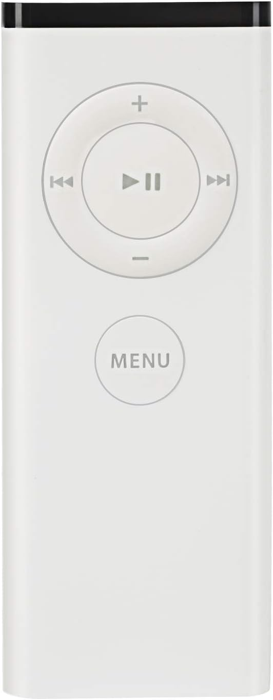

# apple_remote
Apple Remote (A1156) Micropython

This code is based on https://github.com/peterhinch/micropython_ir

Version 1.0.1 

This is the first attempt to create micropython code to work with the Apple Remote A1156

Issues:
    - figure out how to handle repeating codes
    - I get 2 callbacks for every (one) press
